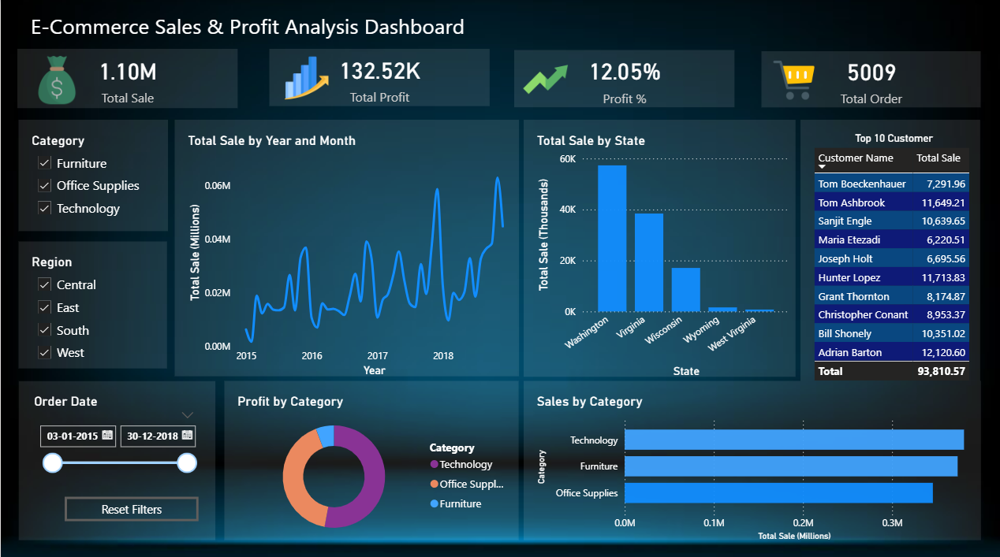

# 📊 E-Commerce Sales & Profit Dashboard (Power BI)

## 🚀 Project Overview
This project presents an interactive Power BI dashboard analyzing e-commerce sales performance, profit trends, and customer insights.

## 🔧 Tools & Technologies
- Power BI
- DAX (Data Analysis Expressions)
- Data Visualization

## 📈 Key Insights
- Technology category generates highest sales
- Sales show consistent growth over time
- Top customers contribute significantly to revenue
- Regional performance differences identified

## 📊 Dashboard Features
- KPI Cards (Total Sales, Profit, Profit %, Orders)
- Sales trend over time (Year & Month)
- Sales distribution by state
- Category-wise performance
- Top 10 customers analysis
- Interactive filters (Category, Region, Date)

## 📸 Dashboard Preview

## 🎯 Business Use Case
This dashboard helps businesses track sales performance, identify profitable categories, and analyze customer contribution to revenue, enabling better decision-making.

## 📂 Files Included
- `E-commerce.pbix` → Power BI dashboard file
- `dashboard-preview.png` → Dashboard screenshot
